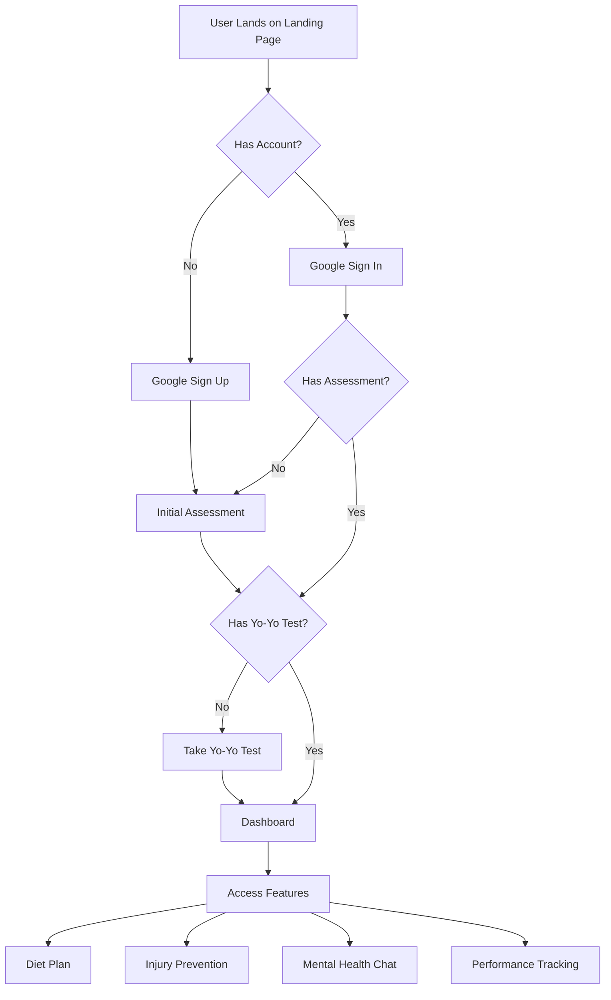
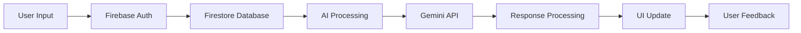
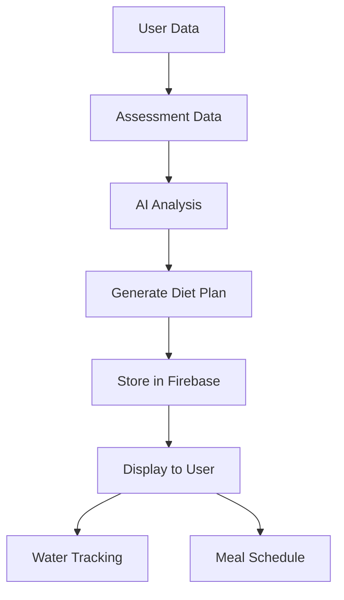
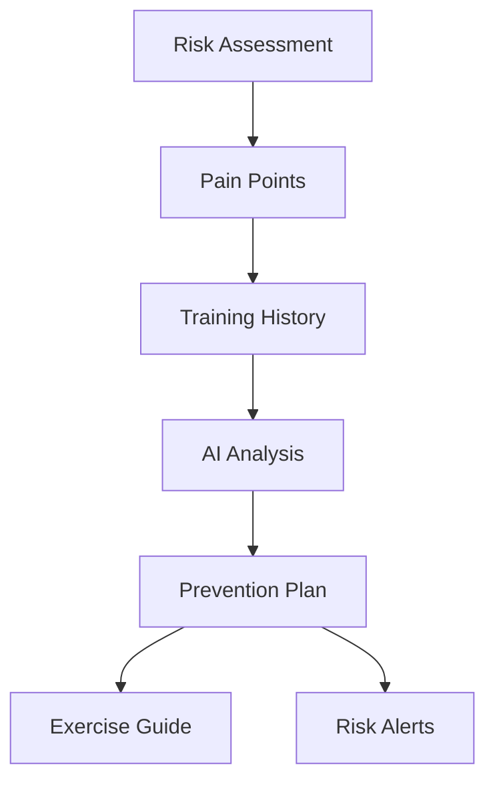
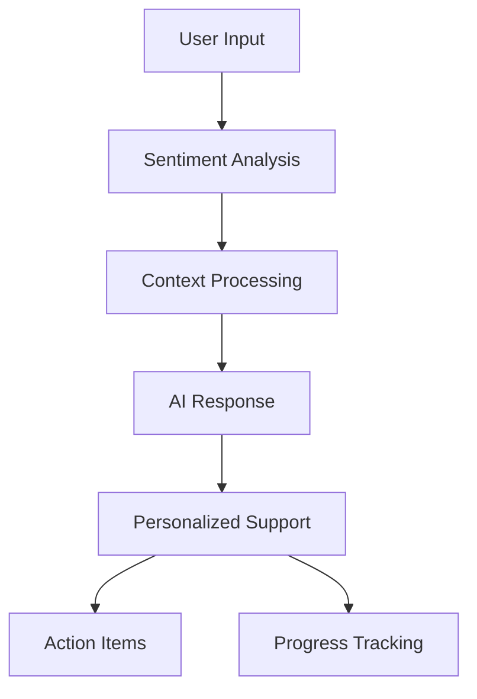
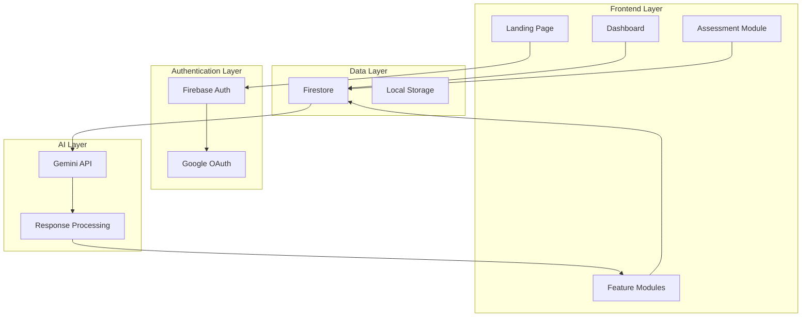
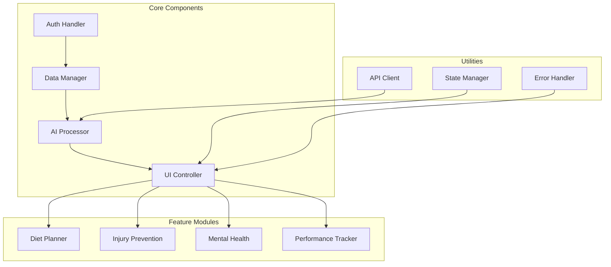
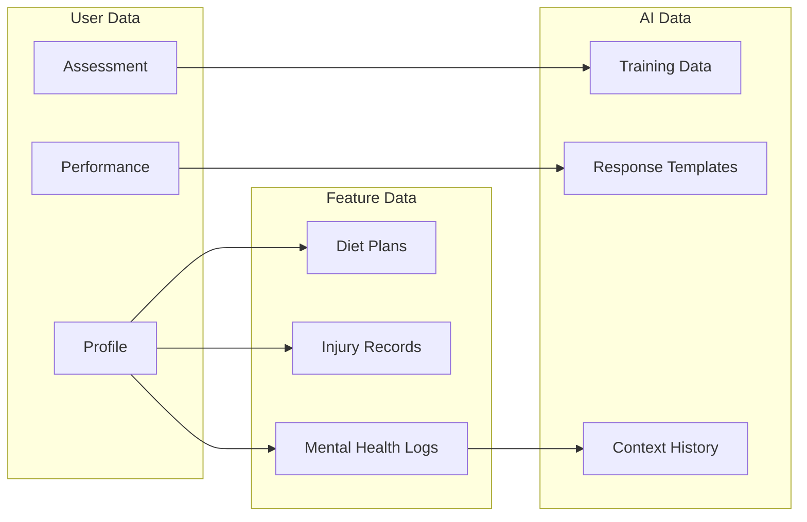
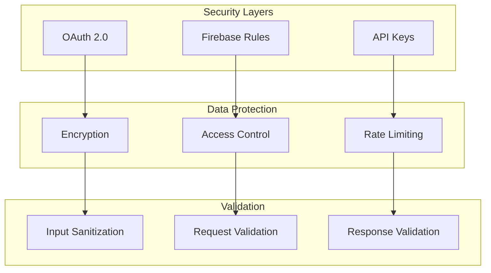
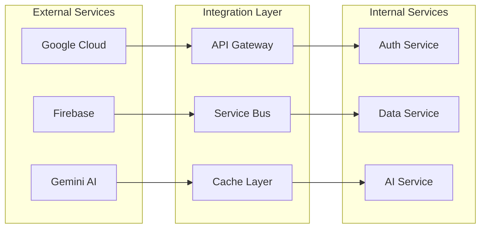

# AthleteAI Process Flow

## 1. User Journey Flow

## 2. Data Flow

## 3. Feature Workflows

### 3.1 Diet Planning

### 3.2 Injury Prevention

### 3.3 Mental Health Support

# AthleteAI System Architecture

## 1. High-Level Architecture

## 2. Component Architecture

## 3. Data Architecture

## 4. Security Architecture

## 5. Integration Architecture

