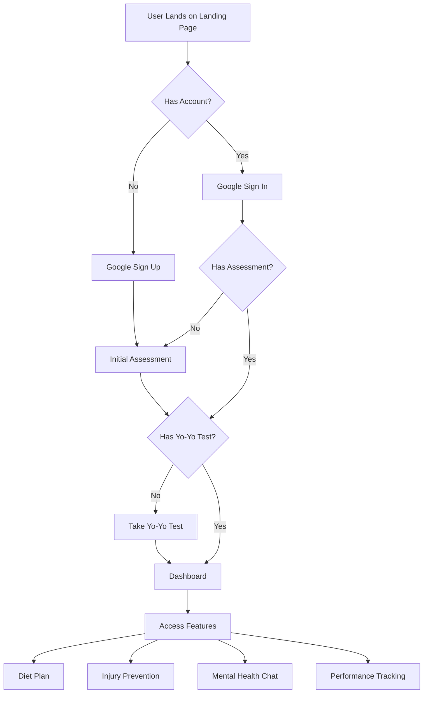
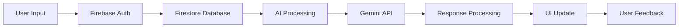
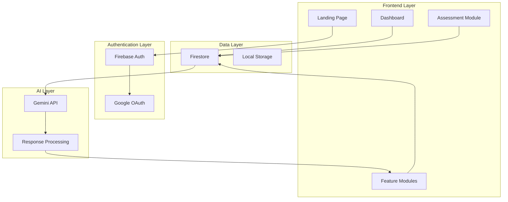
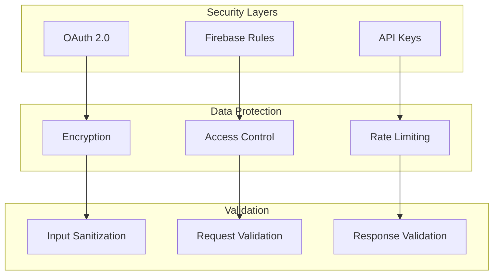

# AthleteAI Process Flow

## 1. User Journey Flow

### Tools Used:
<table>
  <tr>
    <td></td>
    <td></td>
    <td></td>
    <td></td>
  </tr>
</table>

## 2. Data Flow

### Tools Used:
<table>
  <tr>
    <td></td>
    <td></td>
    <td></td>
    <td></td>
  </tr>
</table>

# AthleteAI System Architecture

## 1. High-Level Architecture

### Tools Used:
<table>
  <tr>
    <td></td>
    <td></td>
    <td></td>
    <td></td>
  </tr>
</table>

## 2. Security Architecture

### Security Tools Used:
<table>
  <tr>
    <td></td>
    <td></td>
    <td></td>
    <td></td>
  </tr>
</table>

---
